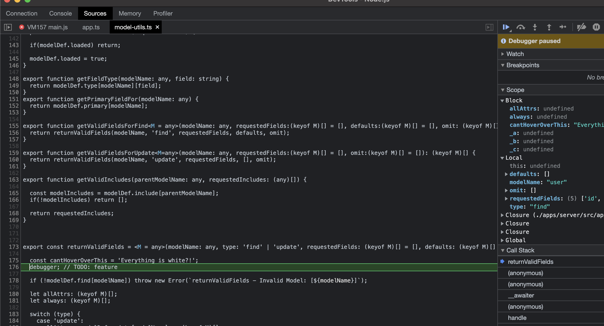
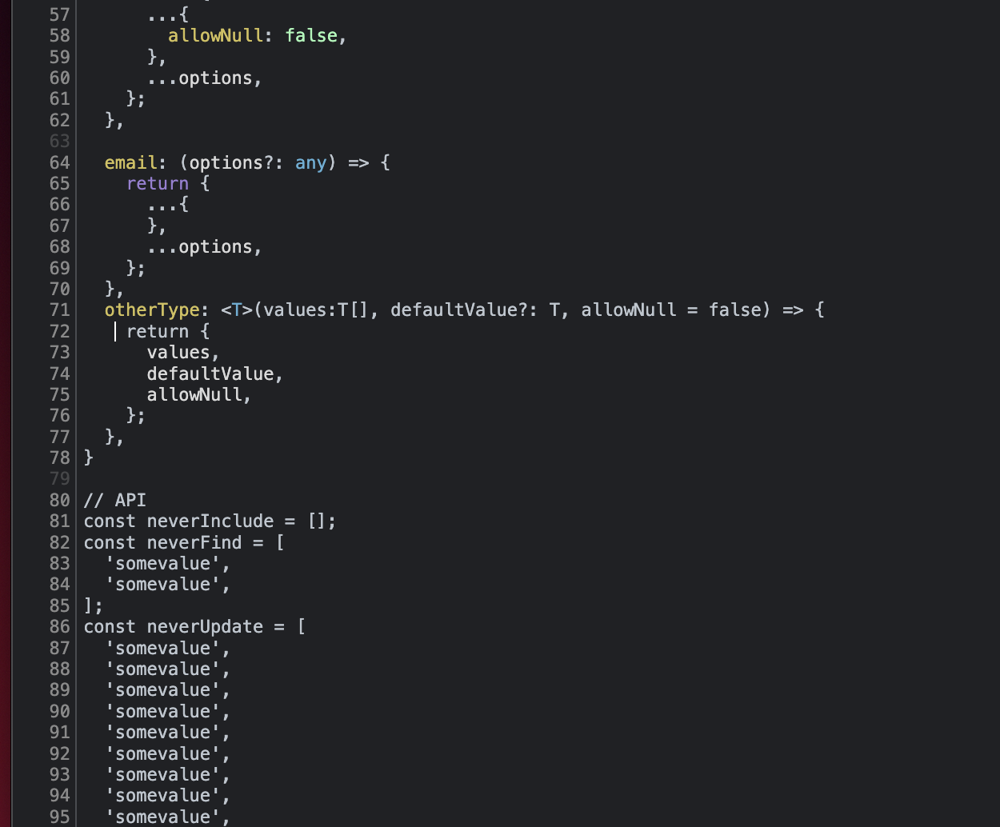

# Chrome Debugger Borked in very basic express app

### the bug
Chrome debugger fails to render any tooltips, color coding is gone... things are seem to be missing from scope (probably why tooltips dont work)

Ive stripped everything possible out of my app.. this is the most basic implementation that reproduces the bug.

# occurs for sure on:
- MacOs 12.6 (monterey)
- node 16.17.0 (i tried 12.12 also)
- Pretty sure this was occurring on my Windows10 at home as well.. but im on holiday right now and cant verify

# Some images
the code just goes white and tooltips etc no longer work...
debugging become extremely difficult

The top part of the file often looks fairly normal... but just falls apart randomly

